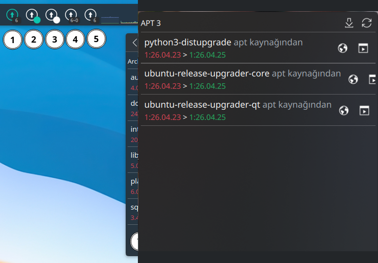

# APT Update Counter - KDE Plasma 6 Widget

   

A clean, responsive, and customizable KDE Plasma 6 widget / system tray applet to monitor and manage pending **APT**, **Snap**, and **Flatpak** package updates on Kubuntu, Ubuntu, and Debian systems.

Forked and adapted from the excellent [bouteillerAlan/archupdate](https://github.com/bouteillerAlan/archupdate) project with native APT, Snap, and Flatpak support.



1 - Custom icon color | 2 - Custom dot color | 3 - Default dot | 4 - Label with separator | 5 - Label without separator | 6 - In the system tray | 7 - Package list popup

---

## Features

- **Multi-Ecosystem (APT, Snap & Flatpak):** Concurrently tracks core system APT packages and modern containerized Snap and Flatpak applications.
- **Selective Ecosystem Toggles:** Independent toggles for Snap and Flatpak updates. Run both, Snap only, Flatpak only, or disable secondary managers completely for a lightweight APT-only setup with zero idle background overhead.
- **Ubuntu Phased Updates Management:** Intelligently filter out staged/deferred phased updates so your badge accurately reflects immediately installable updates, or choose to include and forcibly upgrade phased packages. Individual package clicks always install directly.
- **Silent Background Updates:** Optional non-interactive background upgrade mode via `pkexec` without opening a terminal window.
- **Rich Icon States & Animation:** Active updates feature a smooth rotation animation and theme accent color; update errors display a negative red error badge (`!`) with diagnostic tooltips.
- **Dedicated Notifications Tab:** Consolidated settings tab for desktop notifications: alerts for newly discovered updates, system restart required alerts, and silent background upgrade completion.
- **Fail-Safe Policy:** Critical package management errors and failure alerts are guaranteed to surface even if optional notifications are turned off.
- **Responsive Popup Layout:** Dynamically constrained popup width (320px - 580px) with elegant text truncation (`...`) for long package names, keeping action buttons aligned and accessible.
- **Interactive Popup:** Click to view available updates (`<package> <installed-version> -> <new-version>`), with direct links to [packages.ubuntu.com](https://packages.ubuntu.com) for APT, [snapcraft.io](https://snapcraft.io) for Snap, and [flathub.org](https://flathub.org) for Flatpak packages.
- **Reboot Required Detection & Notification:** Automatically detects `/var/run/reboot-required` (e.g. following kernel, systemd, or glibc updates) and sends a native desktop alert while displaying clear restart warnings in both the tooltip and popup.
- **Internationalization (i18n):** Full GNU Gettext localization support. The canonical source code is 100% English, while automatically displaying in the user's desktop language (Turkish catalog included, community translations welcome).
- **One-Click Upgrades:** Launch full system upgrades or upgrade individual packages in Konsole or silently in the background directly from the applet or via mouse middle-click.
- **System Tray & Panel Friendly:** Works both as an independent panel widget or integrated into the KDE System Tray (with auto-hide when up to date).
- **Fully Customizable:** Custom refresh intervals, appearance styles (dual dots, badge labels with separators, colors), and fully editable commands.
- **Native Breeze Theming:** Integrates with KDE Plasma's `system-software-update` icon for full theme consistency.
- **Graceful Fallbacks:** Operates seamlessly even if Snap or Flatpak is not installed on the system.

---

## Installation

### 1. Requirements

Ensure you have `konsole` installed on your system (default on Kubuntu):

```bash
sudo apt install konsole
```

### 2. Quick Install (from Source)

Run the following commands in your terminal:

```bash
# Clone the repository
git clone https://github.com/hadbilen/aptupdate.git /tmp/aptupdate

# Install into KDE Plasma 6 user plasmoids directory
mkdir -p ~/.local/share/plasma/plasmoids
cp -r /tmp/aptupdate/hadbilen.aptupdate.plasmoid ~/.local/share/plasma/plasmoids/

# Refresh KDE system cache
kbuildsycoca6 --noincremental

# Restart Plasmashell (flushes in-memory QML cache without closing open apps)
systemctl --user restart plasma-plasmashell.service

# Clean up temporary clone
rm -rf /tmp/aptupdate
```

### 3. Adding to Panel or System Tray

1. **On Panel:** Right-click your KDE panel, select **Add Widgets...** (Gereç Ekle), search for **APT Update Counter**, and drag it onto your panel.
2. **In System Tray:** Right-click the System Tray arrow -> **Configure System Tray...** -> **Entries** -> ensure **APT Update Counter** is set to *Shown when relevant* or *Always shown*.

---

## Default Commands Configuration

The applet comes pre-configured for Debian / Ubuntu / Kubuntu:

| Setting | Default Command | Description |
| :--- | :--- | :--- |
| **Enable Snap Updates** | `true` | Toggle tracking and upgrading Snap packages |
| **Enable Flatpak Updates** | `true` | Toggle tracking and upgrading Flatpak packages |
| **Include Phased Updates** | `false` | Include staged/deferred phased updates in count/list (and force in full upgrade) |
| **Silent Background Updates** | `false` | Run upgrades silently via `pkexec` without opening a terminal window |
| **Notify on Silent Update** | `true` | Desktop notification upon completion (critical failure errors are always notified) |
| **Count APT Command** | `apt list --upgradable 2>/dev/null \| grep -c '\['` | Counts pending APT package updates |
| **Count Secondary (Snap/Flatpak)** | `s=0; f=0; which snap >/dev/null 2>&1 && s=$(snap refresh --list 2>/dev/null \| tail -n +2 \| wc -l \|\| echo 0); which flatpak >/dev/null 2>&1 && f=$(flatpak remote-ls --updates 2>/dev/null \| wc -l \|\| echo 0); echo $((s + f))` | Concurrently counts Snap and Flatpak updates |
| **List APT Command** | `apt list --upgradable 2>/dev/null \| grep '\[' \| awk -F'[/ ]+' '{old=$NF; sub(/\]/,"",old); print $1, old, "->", $3}'` | Formats package name and version difference |
| **List Secondary Command** | `(which snap >/dev/null 2>&1 && snap refresh --list 2>/dev/null \| awk 'NR>1 {print $1, "snap", "->", $2}') ; (which flatpak >/dev/null 2>&1 && flatpak remote-ls --updates 2>/dev/null \| awk '{print $1, "flatpak", "->", $2}')` | Formats Snap & Flatpak updates |
| **Update All Command** | `sudo apt update && sudo apt upgrade && (which snap >/dev/null 2>&1 && sudo snap refresh \|\| true) && (which flatpak >/dev/null 2>&1 && flatpak update -y \|\| true)` | Full system upgrade (APT + Snap + Flatpak) |
| **Update One Command** | `sudo apt install --only-upgrade` | Upgrade single selected package (Snap/Flatpak routed automatically) |
| **Terminal Command** | `konsole -e` | Terminal emulator wrapper |

---

## Contributing & Translations

Translations are managed using standard GNU Gettext under `translate/`:

```bash
# To update template.pot and compile all .po files to .mo:
./translate/build.sh
```

To contribute a new language, copy `translate/template.pot` to `translate/<lang>.po`, translate the strings, and submit a pull request.

---

## Credits & Upstream

- **Original Creator & UI Design:** [Alan Bouteiller (A2N)](https://github.com/bouteillerAlan) - [bouteillerAlan/archupdate](https://github.com/bouteillerAlan/archupdate).
- **Debian / Ubuntu / Snap / Flatpak Port & Maintainer:** [hadbilen](https://github.com/hadbilen) - [hadbilen/aptupdate](https://github.com/hadbilen/aptupdate).

## License

GNU General Public License v3.0 (GPL-3.0). See [LICENSE](LICENSE) for details.
